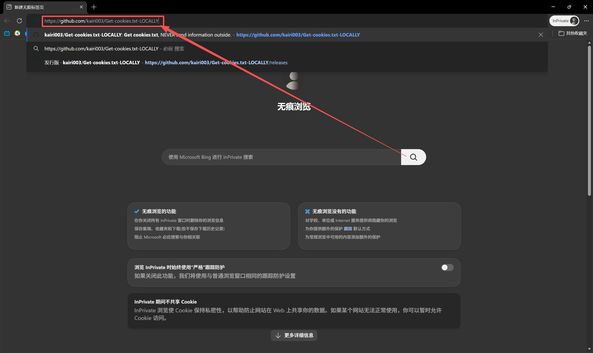
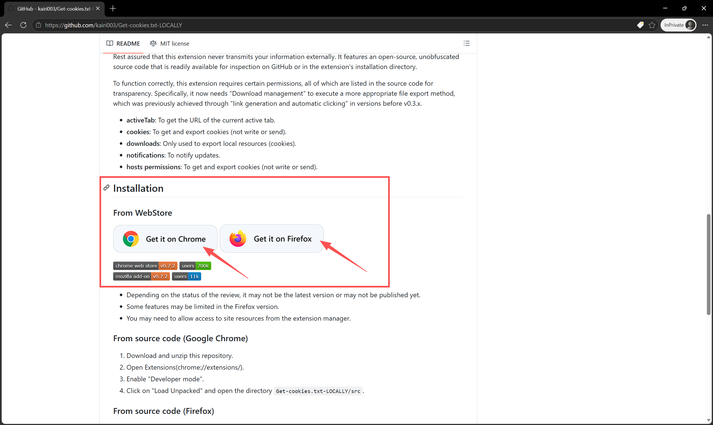
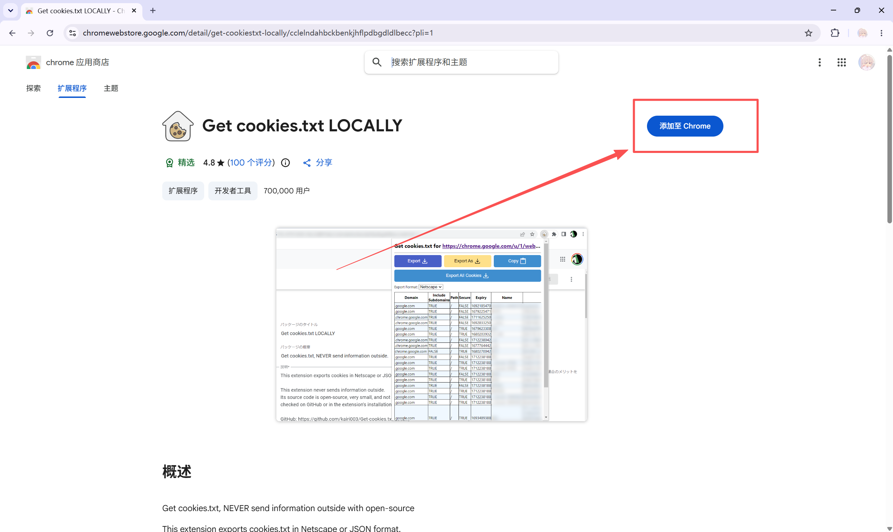
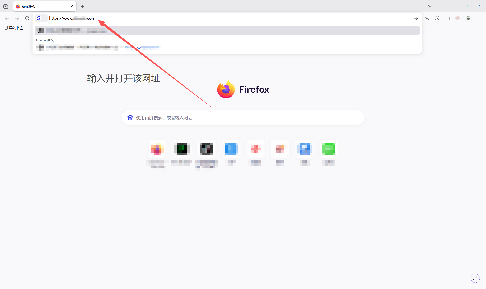
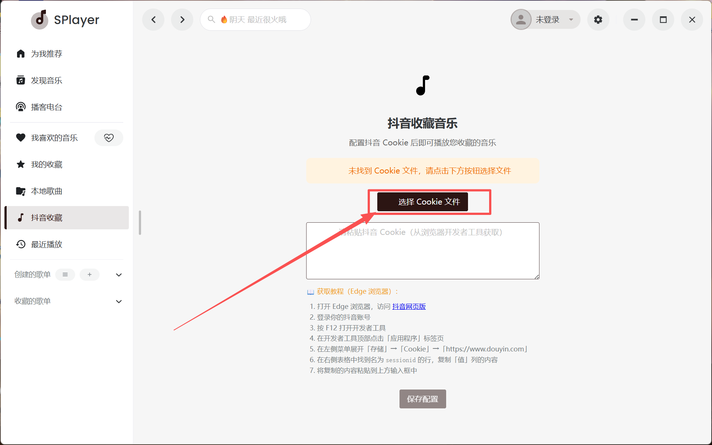

# 使用文档，更新时间：2026/6/26

### 步骤 1 - [点击跳转](https://github.com/kairi003/Get-cookies.txt-LOCALLY) 下载扩展

### 步骤 2 - 选择浏览器安装扩展

### 步骤 3 - 安装cookies-txt

### 步骤 4 - 打开对应网址DY

### 步骤 5 - 确保已登录DY

### 步骤 6 - 选择下载当前页面

### 步骤 7 -点击选择文件，选择刚下载的文件

